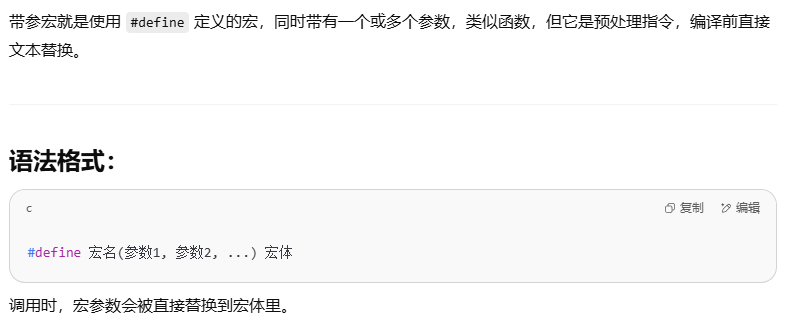

# 宏
## 带参的宏
### 
```
类似于
#define area(a,b,c)（sprt(S*(S-a)*(S-b)*(S-c))）
```
#### 注意事项：
1、宏展开是简单的文本替换，没有类型检查。

2、宏参数最好用括号包起来，避免运算优先级错误。

3、宏体尽量写成表达式或者代码块 { ... }，方便调用。

### 带参的宏也可以相互嵌套调用
```
#define area(a,b,c)(sqrt(S(a,b,c)*(S(a,b,c)-a)*(S(a,b,c)-b)*(S(a,b,c)-c)))
#define S(a,b,c) ((a+b+c)/2.0)
```