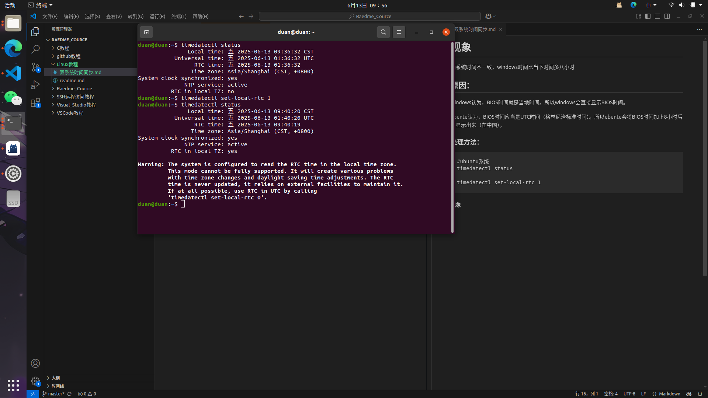

# 现象
两系统时间不一致，windows时间不准
## 原因：
windows认为，BIOS时间就是当地时间。所以windows会直接显示BIOS时间。

ubuntu认为，BIOS时间应当是UTC时间（格林尼治标准时间）。所以ubuntu会将BIOS时间加上8小时后再显示出来（在中国）。

### 处理方法：
```
#ubuntu系统
timedatectl status

timedatectl set-local-rtc 1
```
#### 现象

### 现象解释：
1、Local time=9点，是ubuntu联网获取到的当地时间
2、RTC time=4点，是电脑的BIOS时间
3、RTC in local TZ=no，这句话代表系统时间和BIOS时间不同步，即BIOS存储的是UTC时间，而系统时间是当地时间

