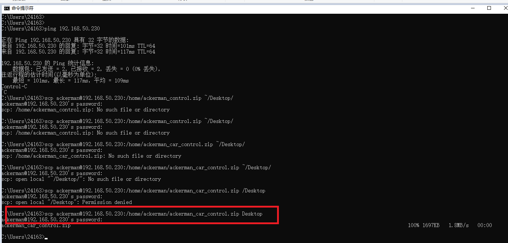

# Windows连接Ubuntu
## 1、将Windows文件通过SSH协议传输至Ubuntu
### 1.1、通过git软件实现
#### 1.1.1、目标是连接到服务器
```
ssh username@hostname

ssh duan@172.26.239.57

#安全退出
exit 
或者ctrl+D
```
##### 现象：

#### 1.1.2、目标是传输文件
```
# 向远程主机传输文件
scp nomachine_9.0.188_11_x64.zip duan@172.26.239.57:/home/duan/

# 从远程主机拿取文件
scp duan@172.26.239.57:/home/duan/nomachine_9.0.188_11_x64.zip Desktop

```

##### 现象：


# linux向win发送文件
```bash
1、在win中使用powershell以管理员身份打开终端
windows:
安装sshd服务
Add-WindowsCapability -Online -Name OpenSSH.Server~~~~0.0.1.0

查看ssh状态
Get-Service sshd
Start-Service sshd

设置开机自启
Set-Service -Name sshd -StartupType Automatic

绑定串口
netsh advfirewall firewall add rule name="OpenSSH" dir=in action=allow protocol=TCP localport=22

linux:
ssh Xiaolong@192.168.10.51

ssh-keygen -f "/home/orangepi/.ssh/known_hosts" -R "192.168.10.51"

# 地址后面不要写空格
scp -r GUI_ROS2_12_7/ Xiaolong@192.168.10.51:D:/software_data/MobaXterm/Workspace

```

错误分析1：
添加环境变量： 系统变量-> path->添加C:\Windows\System32\OpenSSH\
