# RK3588上Ubuntu系统的烧录工作在windows中将进行
# RK3588主板升级固件教程--安装桌面版ubuntu

## 1、电脑解压安装3588的驱动：DriverAssitant_v5.1.1
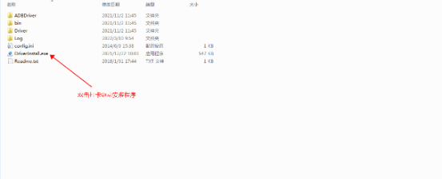

## 2.点击驱动安装后，等待安装完成提示;
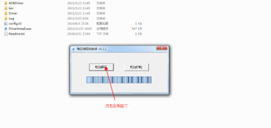

## 3、解压安装固件升级工具：RKDevTool_Release_v2.84
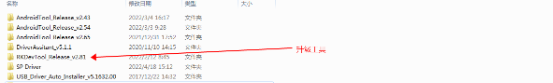

## 4、双击打开升级工具
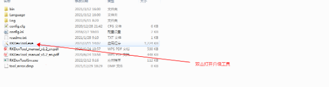

## 5、打开工具后点击固件
```
这里的固件是固定的版本，贺工直接给我的。
```
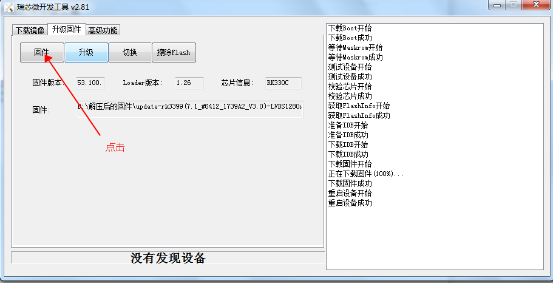

## 6、找到需要升级的固件后，点击打开;
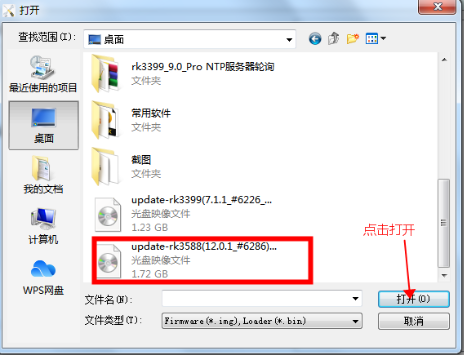

## 7、等待固件加载到升级工具里面;
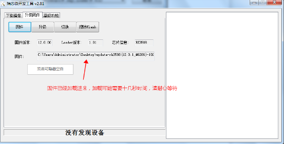

## 8、用升级线连接主板和电脑；
```
使用双USB口线！
```
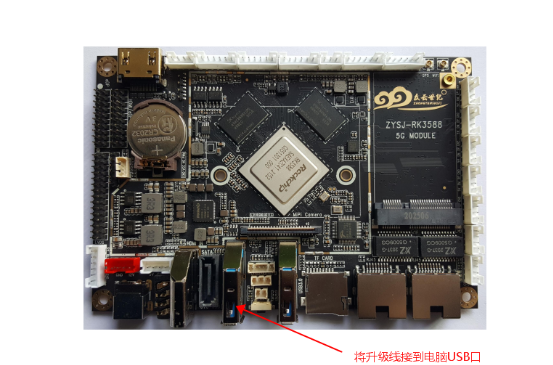

## 9、主板上电前按住升级键，上电后看到蓝灯快速闪烁3下就可以分开;
```
按住升级键，实际操作中并没有蓝灯闪烁！
```
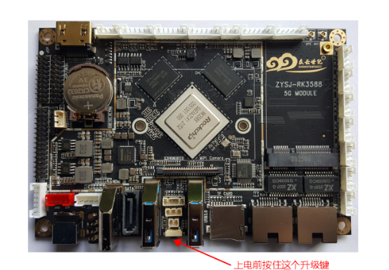

## 10、然后会出现LOADER设备，点击升级即可;
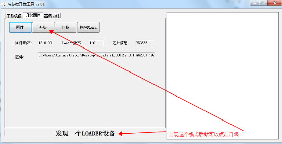


## 11、出现下图所示就表示是升级成功
```
右侧显示重启成功，底下并不会显示发现一个ADB设备，在装android可能会显示。
```

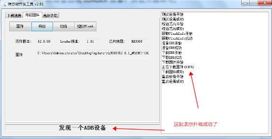

