# 在windows下从0配置yolo环境
# 安装miniconda

下载网址：<https://www.anaconda.com/download/success>
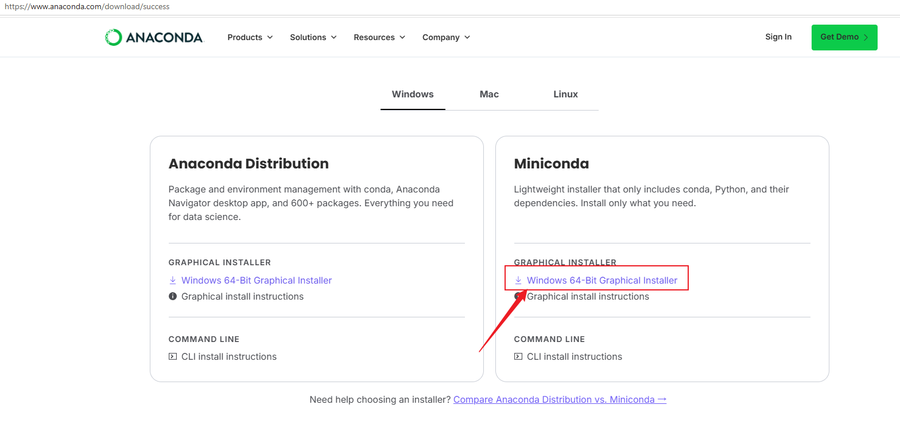

安装时勾选PATH
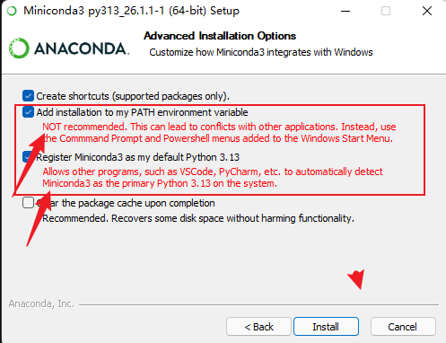

环境验证: 在电脑设置中输入并打开环境变量（一定要在设置中打开），点击“编辑系统环境变量”
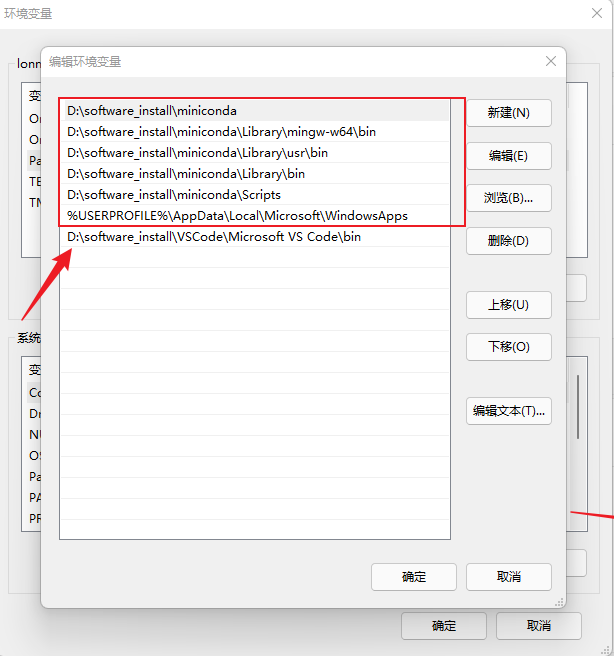

验证：
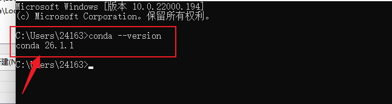

# 安装CUDA

命令行中输入指令“nvidia-smi”，查看cuda版本，最高支持的CUDA版本为12.1，CUDA版本向下兼容，所以12.1版本以下的CUDA，都可以选择安装
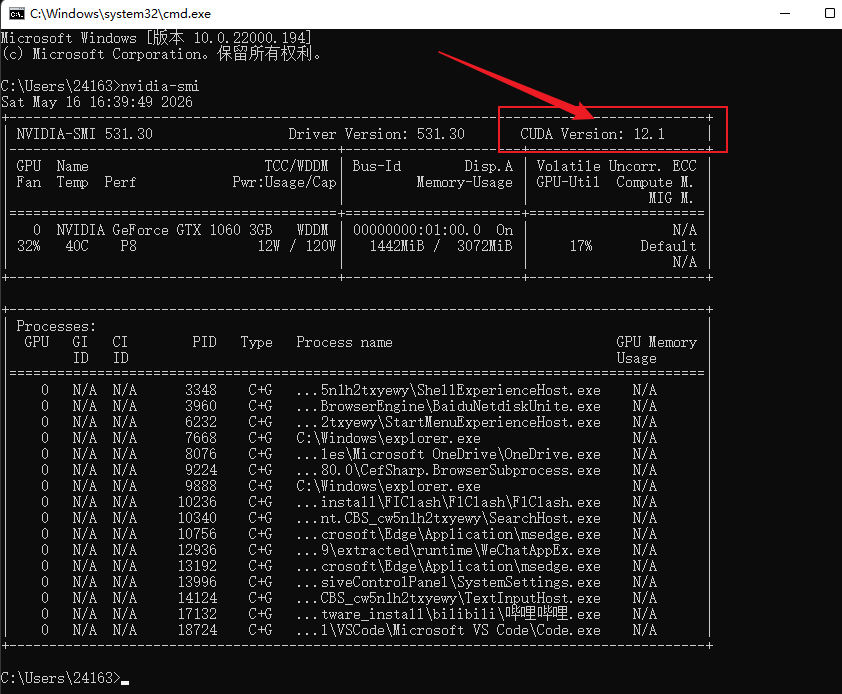

下载链接：<https://developer.nvidia.com/cuda-12-1-1-download-archive>

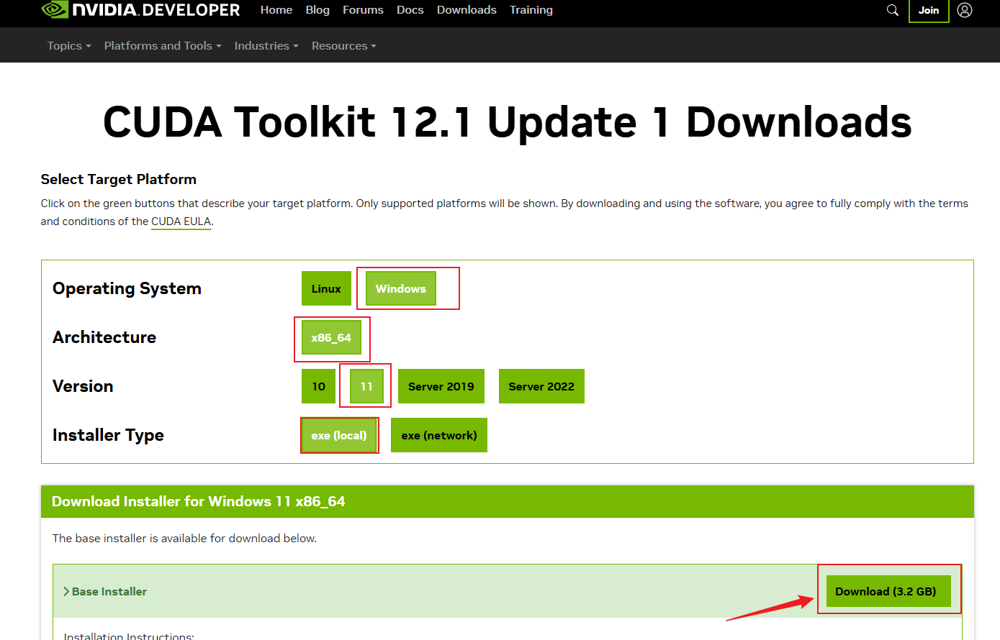

安装位置选择：D:\software_install\CUDA

安装过程:精简-->勾选I understand,-->

验证环境变量：
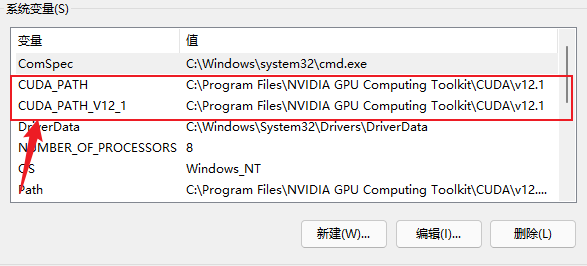

命令行中输入“nvcc --version”，如下图所示，即为安装成功

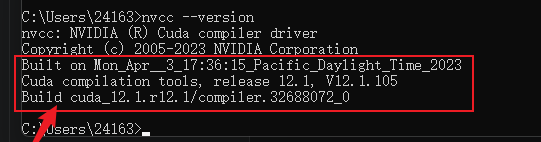

# 下载cuDNN

这里需要Nvidia账号才能下载！！
挂梯子下载！！
网址：<https://developer.nvidia.com/rdp/cudnn-archive>

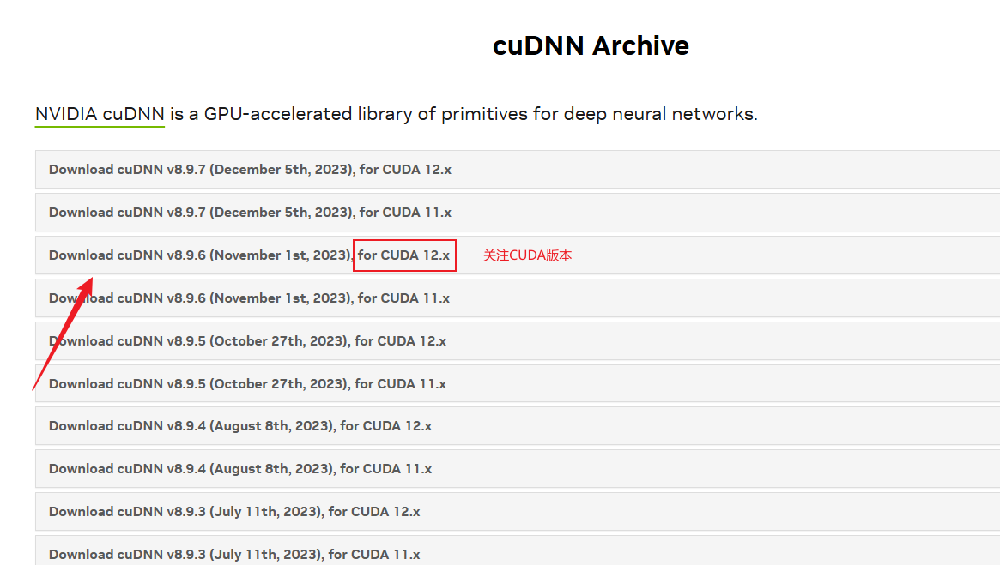

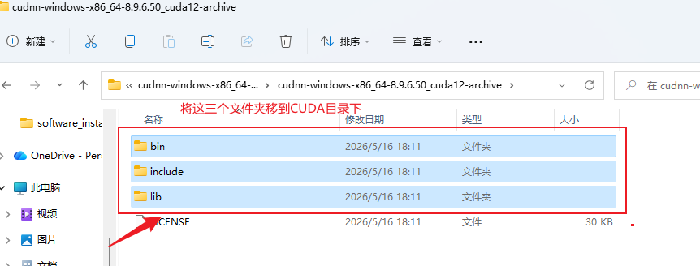

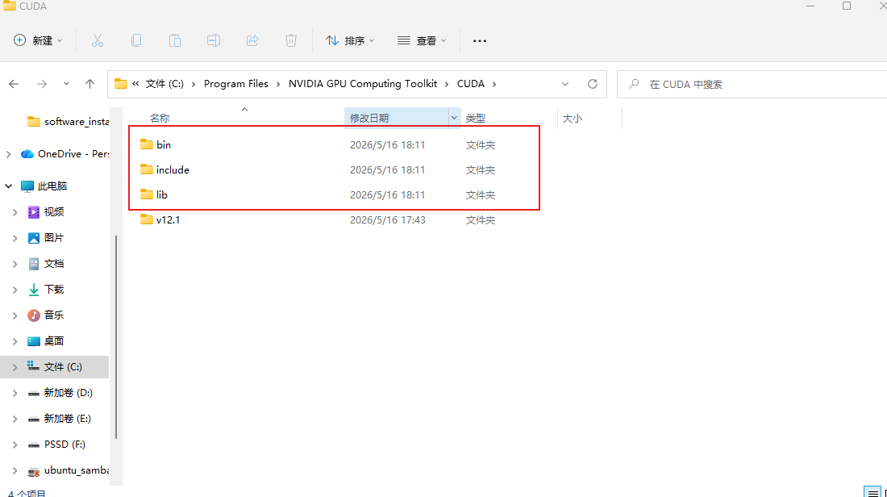

完成配置！！

# 安装pytorch

使用命令行工具创建虚拟环境

conda create -n yolov8 python=3.10

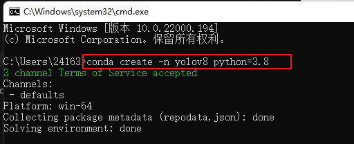

创建虚拟环境
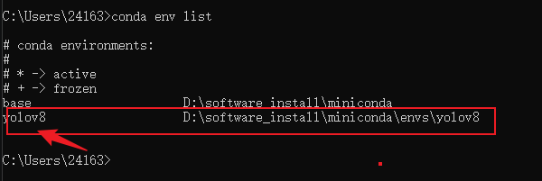
conda和pip设置国内镜像
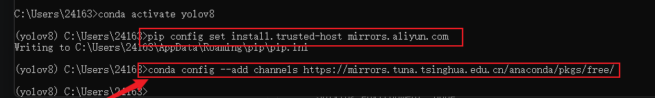

安装地址：<https://pytorch.org/get-started/previous-versions/?_gl=1*o361d8*_up*MQ..*_ga*NjM3MzExOTQ0LjE3Nzg5MjczOTE.*_ga_469Y0W5V62*czE3Nzg5MjczOTAkbzEkZzAkdDE3Nzg5MjczOTAkajYwJGwwJGgw>

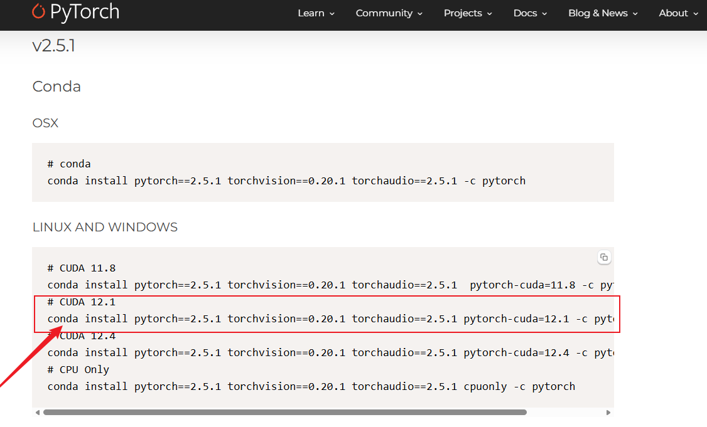

conda install pytorch==2.5.1 torchvision==0.20.1 torchaudio==2.5.1 pytorch-cuda=12.1 -c pytorch -c nvidia

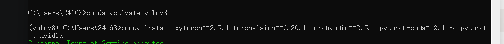

验证安装
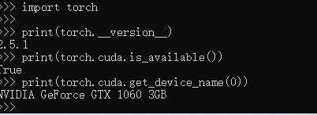

到这里，一个常用的pytorch环境就配置好了！！

# 安装Pycharm

下载链接：<https://www.jetbrains.com/pycharm/download/download-thanks.html?platform=windows>

安装勾选
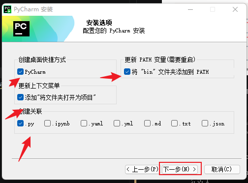

环境验证:
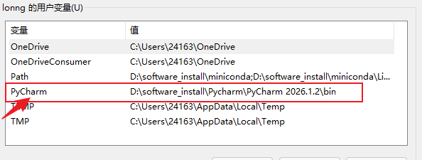

# yolov8下载

下载地址:https://github.com/ultralytics/ultralytics

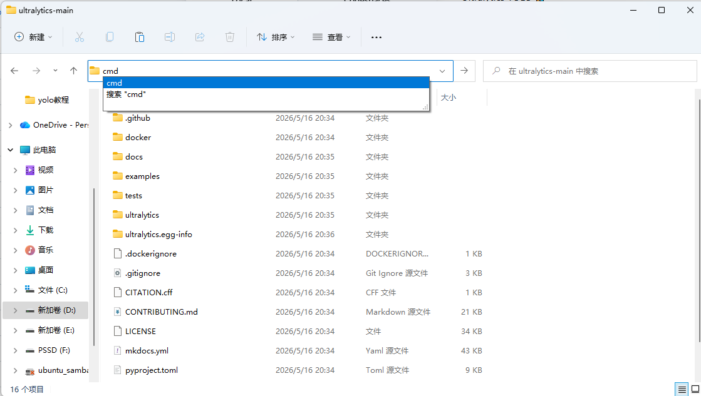

激活环境后输入“pip install -e .”，下载相关库

pip list 检查安装

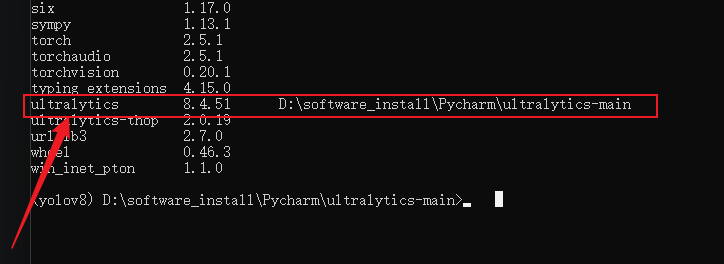

# 使用pycharmm进行开发


打开工程后配置解释器
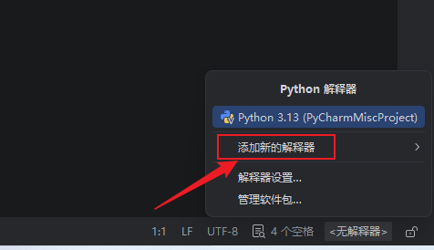

直接进入虚拟环境
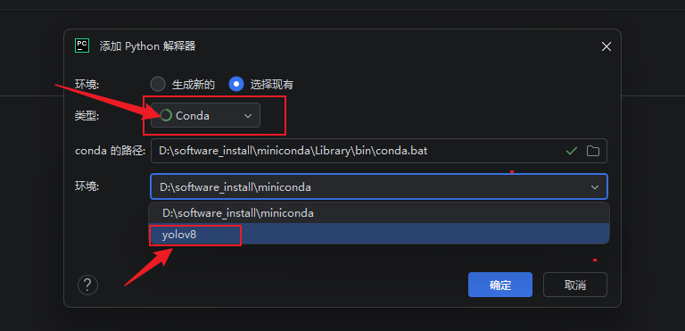

在主目录下创建test.py

```python
from ultralytics import YOLO
yolo = YOLO("./yolov8n.pt", task="detect")
result = yolo(source="./ultralytics/assets/bus.jpg", save=True)
```

运行结果
```bash
(yolov8) PS D:\software_install\Pycharm\ultralytics-main> python .\test.py        
Creating new Ultralytics Settings v0.0.6 file  
View Ultralytics Settings with 'yolo settings' or at 'C:\Users\24163\AppData\Roaming\Ultralytics\settings.json'
Update Settings with 'yolo settings key=value', i.e. 'yolo settings runs_dir=path/to/dir'. For help see https://docs.ultralytics.com/quickstart/#ultralytics-settings.
D:\software_install\miniconda\envs\yolov8\lib\site-packages\torchvision\io\image.py:14: UserWarning: Failed to load image Python extension: '[WinError 127] 找不到指定的程序。'If you don't plan on using image functionality from `torchvision.io`, you can ignore this warning. Otherwise, there might be something wrong with your environment. Did you have `libjpeg` or `libpng` installed before building `torchvision` from source?
  warn(
Downloading https://github.com/ultralytics/assets/releases/download/v8.4.0/yolov8n.pt to 'yolov8n.pt': 100% ━━━━━━━━━━━━ 6.2MB 775.1KB/s 8.3s

image 1/1 D:\software_install\Pycharm\ultralytics-main\ultralytics\assets\bus.jpg: 640x480 4 persons, 1 bus, 1 stop sign, 156.6ms
Speed: 323.5ms preprocess, 156.6ms inference, 466.5ms postprocess per image at shape (1, 3, 640, 480)
Results saved to D:\software_install\Pycharm\ultralytics-main\runs\detect\predict
(yolov8) PS D:\software_install\Pycharm\ultralytics-main> 

```

至此环境搭建已全部完成
