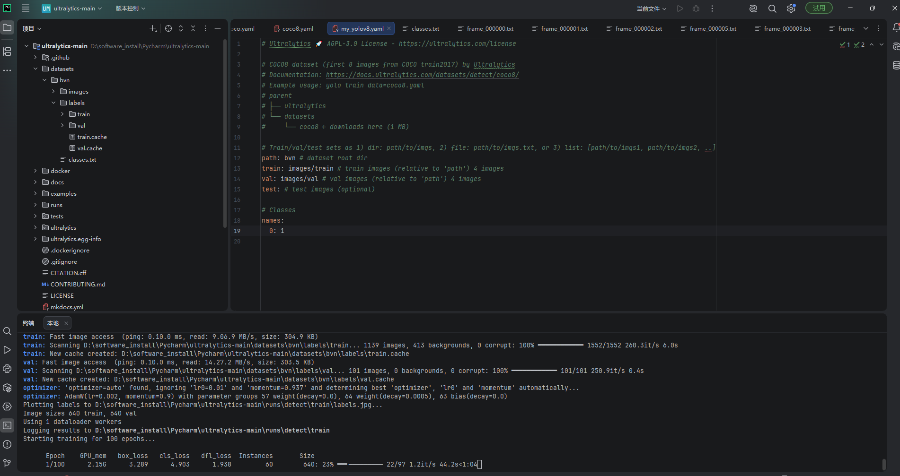

# 操作过程
```bash
# 仅CPU 检测
# 创建虚拟环境
conda create -n yolov8 python=3.8

# 进入虚拟环境
conda activate yolov8

# 安装ultralytics
pip install ultralytics #官方推荐

pip install -e .        #可修改源码

# 检查安装
pip list

进入工作空间
cd ultralytics-main/ultralytics-main

#执行预测任务
yolo task=detect mode=predict model=./model/yolov8n.pt source="./ultralytics/assets/bus.jpg" save_txt=True

```
# 安装GPU版本pytorch
# 对虚拟环境进行创建
```bash
# 查看现有虚拟环境
conda env list

# 删除虚拟环境
conda remove -n yolov8 --all

# 创建虚拟环境
conda create -n yolov8_GPU python=3.10  #python 版本有要求，创建时不要挂梯子

# 安装pytorch-GPU版（12.8）--别挂梯子
pip install torch torchvision torchaudio -i https://pypi.tuna.tsinghua.edu.cn/simple --index-url https://download.pytorch.org/whl/cu128

```
# 安装jupyterlab  --we版IDE编辑器  --现在不需要

# 训练过程

```bash
# 将图像集与标签进行整理
1、在ultraytics同级目录下创建datasets,在datasets目录下创建images和labels分别放训练集与验证集，在images和labels目录下分别创建train和val目录，将classes.txt放在images的同级目录下
2、在ultraytics/cfg/datasets目录下复制一个.yaml文件到datasets同级目录下，重命名.yaml文件
3、更改.yaml文件
  path: bvn
  train: images/train
  val: images/val
  test:

  # 此处是classes.txt文件里面的标签
  names:
  0：1


4、执行训练的三种方式
# 命令行
yolo task=detect mode=train model=./model/yolov8n.pt data=yolo-bvn.yaml epochs=100 workers=1 batch=16

# yolov8_train.py

python3 yolov8_train.py

# 使用默认default_copy.yaml

yolo cfg=default_copy.yaml


```
# 验证过程
```bash
# 使用  --没有效果
yolo task=detect mode=predict model=".\runs\detect\train2\weights\best.pt" source="./test_vedio.mp4" show=True save=false  device="CPU"
# 使用相机进行验证
yolo task=detect mode=predict model=runs/detect/bvn_v1_small/weights/best.pt source=0 conf=0.423 show=True

```

# train10 
yolov11n模型
使用

yolo task=detect mode=predict model=".\runs\detect\train10\weights\best.pt" source="./frame_000242.jpg" show=True save_txt=true  device=0