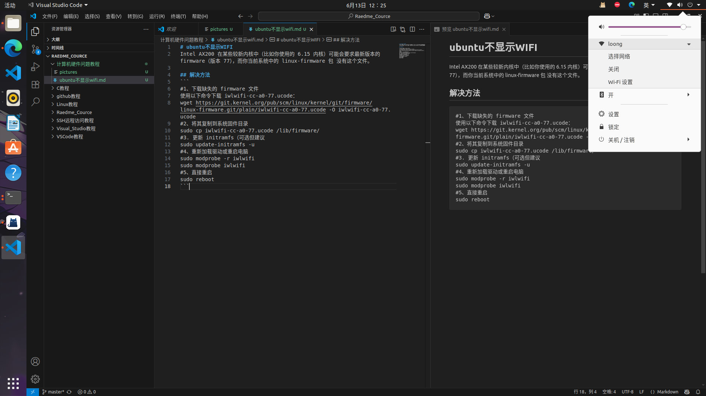

# ubuntu不显示WIFI
Intel AX200 在某些较新内核中（比如你使用的 6.15 内核）可能会要求最新版本的 firmware（版本 77），而你当前系统中的 linux-firmware 包 没有这个文件。

## 解决方法
```
#1、下载缺失的 firmware 文件
使用以下命令下载 iwlwifi-cc-a0-77.ucode：
wget https://git.kernel.org/pub/scm/linux/kernel/git/firmware/linux-firmware.git/plain/iwlwifi-cc-a0-77.ucode -O iwlwifi-cc-a0-77.ucode
#2、将其复制到系统固件目录
sudo cp iwlwifi-cc-a0-77.ucode /lib/firmware/
#3. 更新 initramfs（可选但建议
sudo update-initramfs -u
#4、重新加载驱动或重启电脑
sudo modprobe -r iwlwifi
sudo modprobe iwlwifi
#5、直接重启
sudo reboot
```
### 现象：
